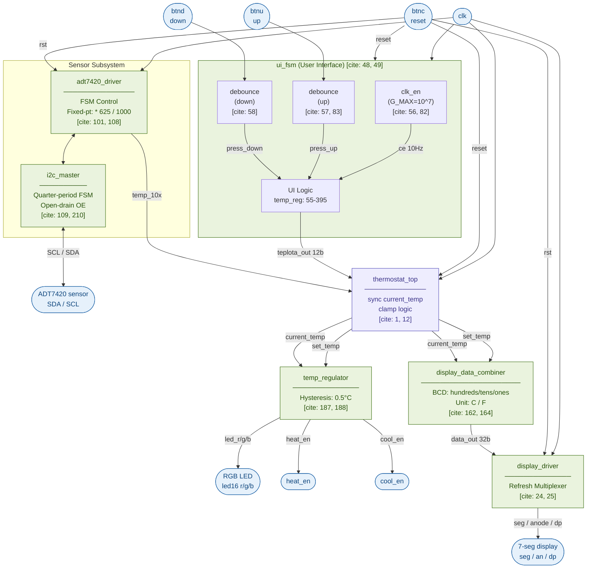
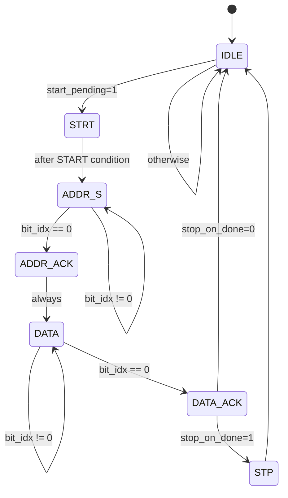
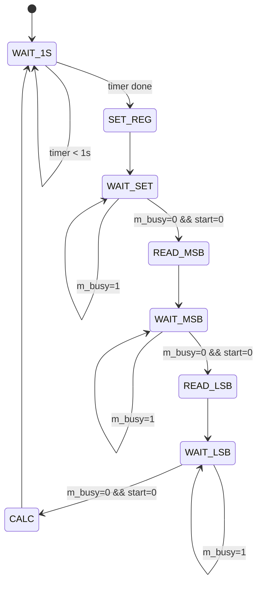

# FPGA I2C Thermostat Driver

This project implements a thermostatic driver using a **Nexys A7 Artix-7 50T** FPGA board. It reads temperature from the onboard **ADT7420** I²C sensor, displays it on 7-segment displays, and allows user interaction via push-buttons. The system controls heating and cooling outputs based on user-defined temperature setpoints, using LEDs to indicate whether heating or cooling is active. The design is written in VHDL, leveraging experience gained in bachelor-level courses at **Brno University of Technology**.

## Team members

- Lukáš Gajdík
- Zuzana Hubáčková
- Jakub Oselka

## Goals

✅ **Lab 1: Architecture.** Block diagram design, role assignment, Git initialization, `.xdc` file preparation.

✅ **Lab 2: Unit Design.** Development of individual modules, testbench simulation, Git updates.

 **Lab 3: Integration.** Merging modules into the Top-level entity, synthesis, and initial HW testing, Git updates.

 **Lab 4: Tuning.** Debugging, code optimization, and Git documentation.

 **Lab 5: Defense.** Completion, video demonstration of the functional device, poster presentation, and code review.

## Project Objectives

1. **Measure temperature** accurately using the ADT7420 sensor over I²C.
2. **Display temperature** in °C a 4-digit 7-segment display.
3. **User interaction**:
    - Adjust temperature setpoint using buttons.
4. **Control logic**:
    - Activate heating or cooling outputs according to temperature and setpoint.
    - Indicate status with LEDs.
5. **Modular VHDL design**:
    - Debounced buttons.
    - I²C master module.
    - Temperature processing and unit conversion.
    - Control logic for thermostat operation.
    - 7-segment display driver with multiplexing.
6. **Reliable and synthesizable design** ready for FPGA implementation.

## Inputs and Outputs

| Port name | Direction | Type                           | Description                                        |
|:---------:|:---------:|:-------------------------------|:---------------------------------------------------|
| `clk`     |    in     | `std_logic`                    | System clock signal                                |
| `btnu`    |    in     | `std_logic`                    | Increment button (increase value)                  |
| `btnd`    |    in     | `std_logic`                    | Decrement button (decrease value)                  |
| `btnc`    |    in     | `std_logic`                    | Reset button (center button)                       |
| `led16_r` |   out     | `std_logic`                    | Heating indicator (red LED)                        |
| `led16_b` |   out     | `std_logic`                    | Cooling indicator (blue LED)                       |
| `led16_g` |   out     | `std_logic`                    | System ready indicator (green LED)                 |
| `seg`     |   out     | `std_logic_vector(6 downto 0)` | 7-segment display cathodes (CA–CG, active-low)     |
| `dp`      |   out     | `std_logic`                    | Decimal point (active-low)                         |
| `anode`   |   out     | `std_logic_vector(7 downto 0)` | 7-segment display anodes (AN7–AN0, active-low)     |
| `TMP_SDA` |  inout    | `std_logic`                    | I²C serial data line                               |
| `TMP_SCL` |   out     | `std_logic`                    | I²C serial clock line                              |

## Diagram (work in progress)

## VHDL FSM diagrams

### States of i2c_master

### States of adt7420_driver

## Simulations

## References
