# FPGA I2C Thermostat Driver

This project implements a thermostatic driver using a **Nexys A7 Artix-7 50T** FPGA board. It reads temperature from the onboard **ADT7420** I²C sensor, displays it on 7-segment displays, and allows user interaction via push-buttons. The system controls heating and cooling outputs based on user-defined temperature setpoints, using LEDs to indicate whether heating or cooling is active. The design is written in VHDL, leveraging experience gained in bachelor-level courses at **Brno University of Technology**.

## Team members

- Lukáš Gajdík
- Zuzana Hubáčková
- Jakub Oselka

## Goals

✅ **Lab 1: Architecture.** Block diagram design, role assignment, Git initialization, `.xdc` file preparation.

✅ **Lab 2: Unit Design.** Development of individual modules, testbench simulation, Git updates.

✅ **Lab 3: Integration.** Merging modules into the Top-level entity, synthesis, and initial HW testing, Git updates.

✅ **Lab 4: Tuning.** Debugging, code optimization, and Git documentation.

 **Lab 5: Defense.** Completion, video demonstration of the functional device, poster presentation, and code review.

## Project Objectives

1. **Measure temperature** accurately using the ADT7420 sensor over I²C.
2. **Display temperature** in °C on a 4-digit 7-segment display.
3. **User interaction**:
    - Adjust temperature setpoint using buttons.
4. **Control logic**:
    - Activate heating or cooling outputs according to temperature and setpoint.
    - Indicate status with LEDs.
5. **Modular VHDL design**:
    - Debounced buttons.
    - I²C master module.
    - Temperature processing and unit conversion.
    - Control logic for thermostat operation.
    - 7-segment display driver with multiplexing.
6. **Reliable and synthesizable design** ready for FPGA implementation.

## Inputs and Outputs

| Port name | Direction | Type                           | Description                                        |
|:---------:|:---------:|:-------------------------------|:---------------------------------------------------|
| `clk`     |    in     | `std_logic`                    | System clock signal (100 MHz)                      |
| `btnu`    |    in     | `std_logic`                    | Increment button (increase setpoint)               |
| `btnd`    |    in     | `std_logic`                    | Decrement button (decrease setpoint)               |
| `btnc`    |    in     | `std_logic`                    | Reset button (center button)                       |
| `led16_r` |   out     | `std_logic`                    | Heating indicator (red LED)                        |
| `led16_b` |   out     | `std_logic`                    | Cooling indicator (blue LED)                       |
| `led16_g` |   out     | `std_logic`                    | System ready / in-range indicator (green LED)      |
| `seg`     |   out     | `std_logic_vector(6 downto 0)` | 7-segment display cathodes (CA–CG, active-low)     |
| `dp`      |   out     | `std_logic`                    | Decimal point (active-low)                         |
| `an`      |   out     | `std_logic_vector(7 downto 0)` | 7-segment display anodes (AN7–AN0, active-low)     |
| `TMP_SDA` |  inout    | `std_logic`                    | I²C serial data line (open-drain, needs pull-up)   |
| `TMP_SCL` |  inout    | `std_logic`                    | I²C serial clock line (open-drain, needs pull-up)  |

> **Note:** `TMP_SDA` and `TMP_SCL` are declared `inout` because I²C is an open-drain bus — the FPGA must both drive the line low and read it back for ACK detection and data reception. This is the only place `inout` appears; all internal components use separate `_oe` / `_in` logic.

## Block diagram

### Architecture overview

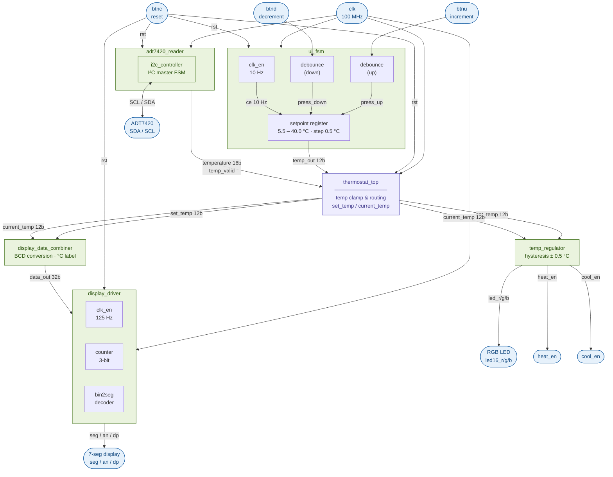

### Diagram of final design

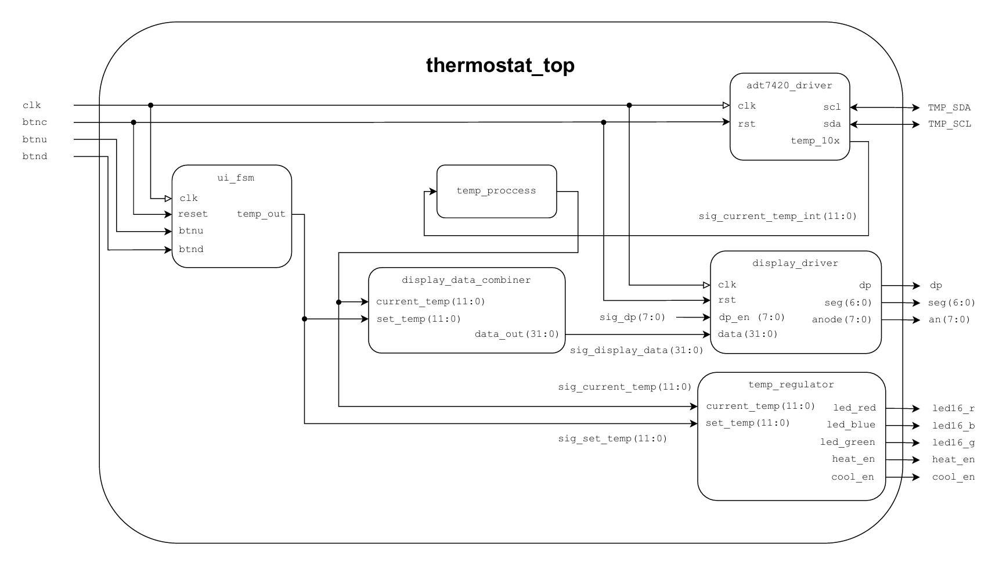

## VHDL FSM diagrams

### States of i2c_controller

State names match the `T_STATE` type in [i2c_controller.vhd](thermostat/thermostat.srcs/sources_1/new/i2c_controller.vhd).
The FSM advances once per rising edge of the internal `running_clock` (derived from the 100 MHz main clock).

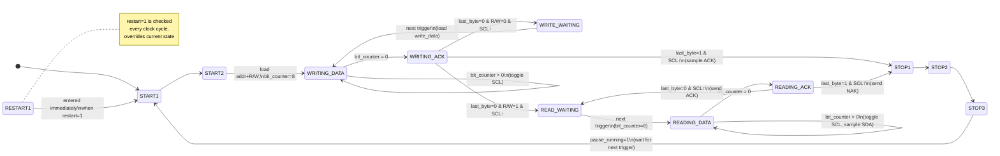

### States of adt7420_reader

State names match the `T_STATE` type in [adt7420_reader.vhd](thermostat/thermostat.srcs/sources_1/new/adt7420_reader.vhd).
Each `_SETUP` state fires a trigger to `i2c_controller`; each `_WAIT` state waits for the `busy` falling edge.

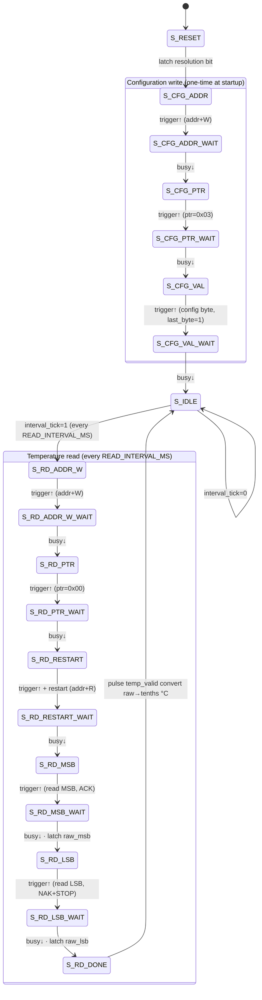

## Module descriptions

### [`thermostat_top`](thermostat/thermostat.srcs/sources_1/new/thermostat_top.vhd)

Top-level entity that wires all subsystems together. Instantiates the sensor reader, UI FSM, display combiner, display driver, and temperature regulator. Contains the only `inout` ports in the design (`TMP_SDA`, `TMP_SCL`) as required by the physical I²C bus. A synchronous process clamps the raw signed 16-bit temperature from the sensor into an unsigned 12-bit value (tenths of °C) for use by the display and regulator.

### `i2c_controller`

Basic I²C master FSM. An internal 7-bit counter divides the 100 MHz clock down to generate a bit clock (`running_clock`). The FSM advances on each rising edge of `running_clock` and sequences through START, address+R/W, data bytes, ACK/NAK, and STOP states. Open-drain operation is implemented via `inout` ports (`scl`, `sda`) driven with tri-state logic using internal signals `scl_local` and `sda_local` — `'1'` releases the line to `'Z'` (pull-up), `'0'` pulls the line low. Adapted from [aslak3/i2c-controller](https://github.com/aslak3/i2c-controller).

### `adt7420_reader`

Wrapper around `i2c_controller` that performs periodic temperature reads from the ADT7420 sensor. At startup it writes the configuration register (resolution selection). Then, every `READ_INTERVAL_MS` milliseconds, it executes a 5-trigger read sequence: address+W → pointer byte → RESTART+address+R → read MSB → read LSB. A separate combinational process converts the raw 16-bit two's-complement ADC value to tenths of °C (signed). Temperature is output as a 16-bit signed vector; `temp_valid` pulses high for one clock cycle per completed reading.

### `ui_fsm`

User-interface state machine for setpoint adjustment. Internally instantiates `clk_en` (10 Hz tick) and two `debounce` instances for the up/down buttons. A fast process latches 1-cycle button-press pulses between slow ticks. A slow process (gated by the 10 Hz CE) increments or decrements the integer setpoint register by 0.5 °C steps (5 in tenths-of-degree units), clamped to the range 5.5 °C – 40.0 °C. The 12-bit result is output as a `std_logic_vector`.

### `temp_regulator`

Purely combinational thermostat controller with hysteresis. Compares `current_temp` against `set_temp ± HYST` (HYST = 5, i.e. ±0.5 °C). Drives `led_red` and `heat_en` when heating is required, `led_blue` and `cool_en` when cooling is required, and `led_green` when the temperature is within the hysteresis band. No clock or reset — output changes immediately with inputs.

### `display_data_combiner`

Purely combinational BCD converter. Takes two 12-bit unsigned values (`set_temp` and `current_temp`, in tenths of °C) and packs them into a single 32-bit word for the display driver. Each value is split into hundreds, tens, and ones digits (4 bits each), with the lowest nibble fixed to `0xC` to display the letter "C" (degrees Celsius) on the rightmost digit of each group. Values above 999 are clamped.

### `display_driver`

Time-multiplexed 8-digit 7-segment display driver. Uses `clk_en` (125 Hz tick, G_MAX = 800 000) and a 3-bit `counter` to cycle through the eight display positions. A combinational case statement selects the active 4-bit nibble from the 32-bit data word, passes it to `bin2seg` for segment decoding, and drives the corresponding anode low. Decimal-point output is taken directly from the matching bit of the `dp_en` mask.

---

### `bin2seg`

Purely combinational 4-bit binary to 7-segment decoder. Covers hexadecimal digits 0–9, A–F with active-low segment outputs (a '0' turns a segment on). The special code `0xC` displays the letter "C" used for the Celsius unit indicator.

### `debounce`

Button debouncer with synchronizer. Samples the raw button input at 2 ms intervals via `clk_en`. Four consecutive equal samples are required before the debounced output changes state (shift-register majority filter). A one-cycle `btn_press` pulse is generated on the rising edge of the debounced output. A two-flip-flop input synchronizer prevents metastability.

### `clk_en`

Parameterizable clock-enable generator. Counts from 0 to `G_MAX − 1` and asserts `ce` for exactly one clock cycle when the count wraps, producing a periodic enable pulse. Used throughout the design to create lower-rate processes without generating additional clocks.

### `counter`

Generic N-bit synchronous up-counter with synchronous reset and clock-enable input. Counts from 0 to `2^G_BITS − 1` and wraps. Used inside `display_driver` to cycle through the 8 display digits.

## Simulations

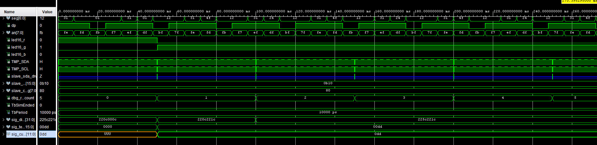
[tb_thermostat_top](thermostat/thermostat.srcs/sim_1/new/tb_thermostat_top.vhd)

---

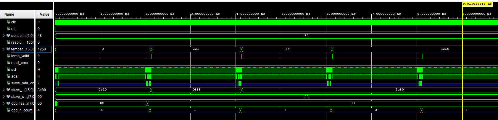
[tb_adt7420](thermostat/thermostat.srcs/sim_1/new/tb_adt7420.vhd)

---

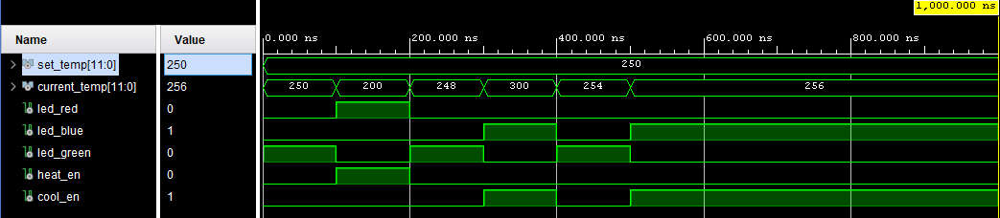
[tb_temp_regulator](thermostat/thermostat.srcs/sim_1/new/tb_temp_regulator.vhd)

---

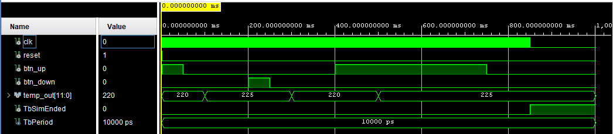
[tb_ui_fsm](thermostat/thermostat.srcs/sim_1/new/tb_ui_fsm.vhd)

---

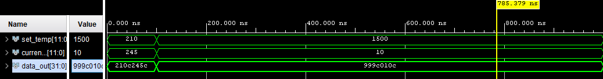
[tb_display_data_combiner](thermostat/thermostat.srcs/sim_1/new/tb_display_data_combiner.vhd)

---

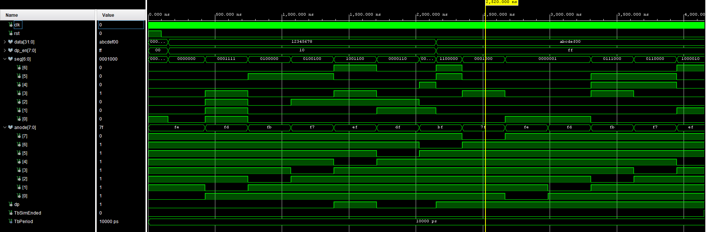
[tb_display_driver](thermostat/thermostat.srcs/sim_1/new/tb_display_driver.vhd)

### Resources from labs

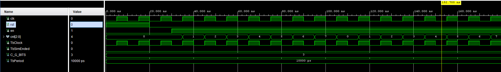
[tb_counter](thermostat/thermostat.srcs/sim_1/new/tb_counter.vhd)

---

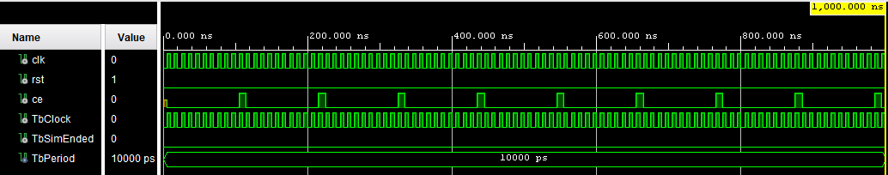
[tb_clk_en](thermostat/thermostat.srcs/sim_1/new/tb_clk_en.vhd)

---

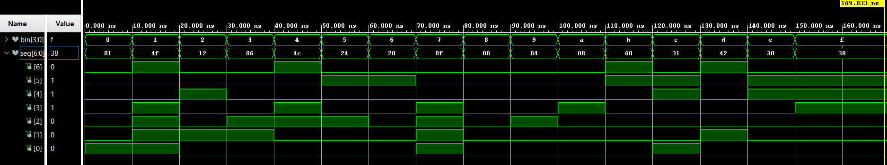
[tb_bin2seg](thermostat/thermostat.srcs/sim_1/new/tb_bin2seg.vhd)

---

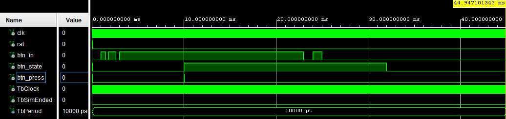
[tb_debounce](thermostat/thermostat.srcs/sim_1/new/tb_debounce.vhd)

## Resource utilization

Post-synthesis results for target device **xc7a50ticsg324-1L** (Nexys A7-50T):

| Resource         | Used  | Available | Utilization |
|:-----------------|------:|----------:|------------:|
| Slice LUTs       | 1 736 |    32 600 |       5.33% |
| Slice Registers  |   247 |    65 200 |       0.38% |
| F7 Muxes         |    17 |    16 300 |       0.10% |
| F8 Muxes         |     6 |     8 150 |       0.07% |
| Block RAM        |     0 |        75 |       0.00% |
| DSP48E1          |     0 |       120 |       0.00% |

Post-implementation LUT count: **1 696** (5.20%).

## Demo video

> *Link will be added after the Lab 5 demonstration.*

## References

1. Analog Devices, *ADT7420 ±0.25°C Accuracy 16-Bit Digital I²C Temperature Sensor*, datasheet Rev. C. [Online]. Available: <https://www.analog.com/media/en/technical-documentation/data-sheets/ADT7420.pdf>
2. Digilent, *Nexys A7 Reference Manual*. [Online]. Available: <https://digilent.com/reference/programmable-logic/nexys-a7/reference-manual>
3. A. Slater, *i2c-controller — A simple I²C controller in VHDL*, GitHub. [Online]. Available: <https://github.com/aslak3/i2c-controller> *(used as the basis for `i2c_controller.vhd`)*
4. T. Fryza, *Digital Electronics 1 — Lab materials*, Brno University of Technology, 2026.
5. Digilent, *Nexys A7 Master XDC constraints file*, GitHub. [Online]. Available: <https://github.com/Digilent/digilent-xdc>
