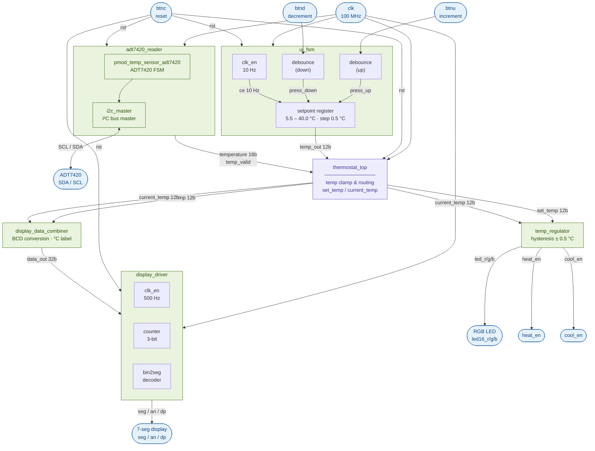
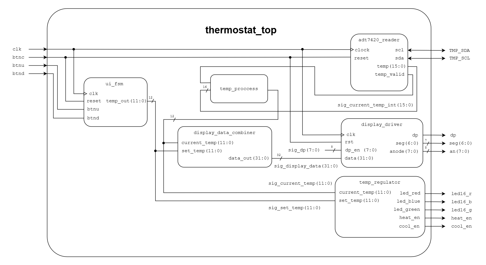
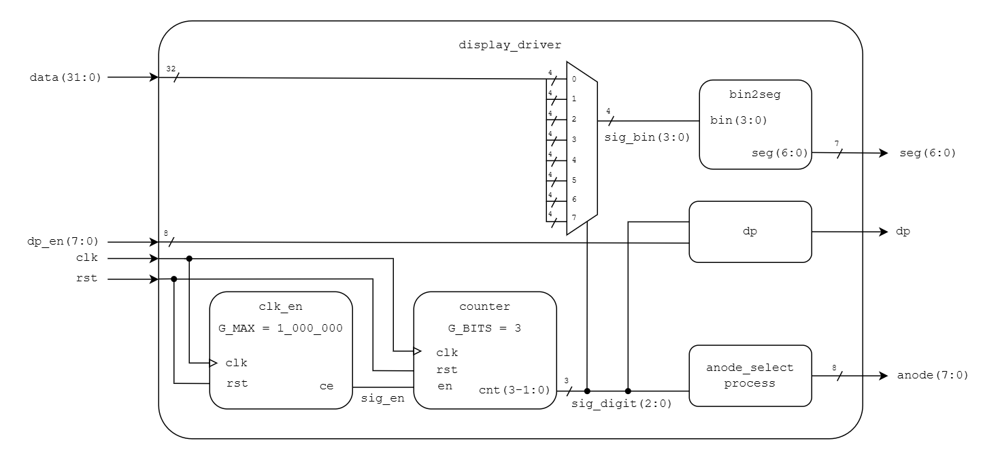

# FPGA I2C Thermostat Driver

This project implements a thermostatic driver using a **Nexys A7 Artix-7 50T** FPGA board. It reads temperature from the onboard **ADT7420** I²C sensor, displays it on 7-segment displays, and allows user interaction via push-buttons. The system controls heating and cooling outputs based on user-defined temperature setpoints, using LEDs to indicate whether heating or cooling is active. The design is written in VHDL, leveraging experience gained in bachelor-level courses at **Brno University of Technology**.

## Team members

- Lukáš Gajdík
- Zuzana Hubáčková
- Jakub Oselka

## Goals

✅ **Lab 1: Architecture.** Block diagram design, role assignment, Git initialization, `.xdc` file preparation.

✅ **Lab 2: Unit Design.** Development of individual modules, testbench simulation, Git updates.

✅ **Lab 3: Integration.** Merging modules into the Top-level entity, synthesis, and initial HW testing, Git updates.

✅ **Lab 4: Tuning.** Debugging, code optimization, and Git documentation.

✅ **Lab 5: Defense.** Completion, video demonstration of the functional device, poster presentation, and code review.

## Project Objectives

1. **Measure temperature** accurately using the ADT7420 sensor over I²C.
2. **Display temperature** (set and measured) in °C on a 8-digit 7-segment display.
3. **User interaction**:
    - Adjust temperature setpoint using buttons.
4. **Control logic**:
    - Activate heating or cooling outputs according to temperature and setpoint.
    - Control relays via the outputs.
    - Indicate status with LEDs.
5. **Modular VHDL design**:
    - Debounced buttons.
    - I²C master module.
    - Temperature processing and conversion.
    - Control logic for thermostat operation.
    - 7-segment display driver with multiplexing.
6. **Reliable and synthesizable design** ready for FPGA implementation.

## Inputs and Outputs

| Port name | Direction | Type                           | Description                                        |
|:---------:|:---------:|:-------------------------------|:---------------------------------------------------|
| `clk`     |    in     | `std_logic`                    | System clock signal (100 MHz)                      |
| `btnu`    |    in     | `std_logic`                    | Increment button (increase setpoint)               |
| `btnd`    |    in     | `std_logic`                    | Decrement button (decrease setpoint)               |
| `btnc`    |    in     | `std_logic`                    | Reset button (center button)                       |
| `led16_r` |   out     | `std_logic`                    | Heating indicator (red LED)                        |
| `led16_b` |   out     | `std_logic`                    | Cooling indicator (blue LED)                       |
| `led16_g` |   out     | `std_logic`                    | System ready / in-range indicator (green LED)      |
| `heat_en` |   out     | `std_logic`                    | Heating output (JA1)                               |
| `cool_en` |   out     | `std_logic`                    | Cooling output (JA2)                               |
| `seg`     |   out     | `std_logic_vector(6 downto 0)` | 7-segment display cathodes (CA–CG, active-low)     |
| `dp`      |   out     | `std_logic`                    | Decimal point (active-low)                         |
| `an`      |   out     | `std_logic_vector(7 downto 0)` | 7-segment display anodes (AN7–AN0, active-low)     |
| `TMP_SDA` |  inout    | `std_logic`                    | I²C serial data line (open-drain, needs pull-up)   |
| `TMP_SCL` |  inout    | `std_logic`                    | I²C serial clock line (open-drain, needs pull-up)  |

> **Note:** `TMP_SDA` and `TMP_SCL` are declared `inout` because I²C is an open-drain bus — the FPGA must both drive the line low and read it back for ACK detection and data reception. This is the only place `inout` appears; all internal components use separate `in` / `out` logic.

## Block diagram

### Architecture overview

### Diagram of final design

## Module descriptions and simulations

### [`thermostat_top`](thermostat/thermostat.srcs/sources_1/new/thermostat_top.vhd)

Top-level entity that wires all subsystems together. Instantiates the sensor reader, UI FSM, display combiner, display driver, and temperature regulator. Contains the only `inout` ports in the design (`TMP_SDA`, `TMP_SCL`) as required by the physical I²C bus. A synchronous process clamps the raw signed 16-bit temperature from the sensor into an unsigned 12-bit value (tenths of °C) for use by the display and regulator.

#### [tb_thermostat_top](thermostat/thermostat.srcs/sim_1/new/tb_thermostat_top.vhd)

---

### [`i2c_master`](thermostat/thermostat.srcs/sources_1/new/i2c_master.vhd)

Digi-Key / Scott Larson byte-level I²C master FSM. An internal clock divider generates `scl_clk` and `data_clk` from the system clock; the FSM advances on `data_clk` edges. Sequences through states `ready → start → command → slv_ack1 → [wr | rd] → [slv_ack2 | mstr_ack] → stop`. Supports continuous multi-byte transactions: when `ena` remains asserted after a byte completes, the master issues a repeated START or continues without a STOP condition. Open-drain operation via tri-state: `scl` and `sda` are driven `'0'` to pull low or released to `'Z'` for the pull-up to assert high. Operates at 400 kHz bus clock (configurable via generic). Imported unmodified from the Digi-Key EEWIKI.

#### [`tb_i2c_controller`](thermostat/thermostat.srcs/sim_1/new/tb_i2c_controller.vhd)

---

### [`pmod_temp_sensor_adt7420`](thermostat/thermostat.srcs/sources_1/new/pmod_temp_sensor_adt7420.vhd)

Digi-Key / Scott Larson ADT7420 controller. Wraps `i2c_master` and orchestrates the full ADT7420 startup and continuous read sequence. On reset release, waits 100 ms for the sensor to power up, then writes `0x80` to the configuration register (address `0x03`) to select 16-bit continuous-conversion mode. After a 1.3 µs inter-transaction pause, it enters a continuous loop: issues a write+repeated-START+read sequence (`addr+W → ptr=0x00 → addr+R → read MSB → read LSB`) to fetch the 16-bit temperature register. The raw 16-bit ADC value (LSB = 1/128 °C in 16-bit mode) is placed on the `temperature` output after each completed read. Imported unmodified from the Digi-Key EEWIKI.

---

### [`adt7420_reader`](thermostat/thermostat.srcs/sources_1/new/adt7420_reader.vhd)

Thin wrapper around `pmod_temp_sensor_adt7420` that adapts it to the thermostat's interface. Inverts the active-high `reset` to `reset_n` for the Larson driver. A registered process monitors the 16-bit `temperature` output of `pmod_temp_sensor_adt7420` and generates a one-cycle `temp_valid` pulse whenever the value changes, signalling a new reading. Simultaneously converts the raw two's-complement value to signed tenths of °C using the identity `tenths = raw × 10 / 128 = (raw << 3 + raw << 1) >> 7`, avoiding a signed multiplier. The 16-bit signed result is forwarded to `thermostat_top` for clamping and display.

#### [tb_adt7420](thermostat/thermostat.srcs/sim_1/new/tb_adt7420.vhd)

---

### [`ui_fsm`](thermostat/thermostat.srcs/sources_1/new/ui_fsm.vhd)

User-interface state machine for setpoint adjustment. Internally instantiates `clk_en` (10 Hz tick) and two `debounce` instances for the up/down buttons. A fast process latches 1-cycle button-press pulses between slow ticks. A slow process (gated by the 10 Hz CE) increments or decrements the integer setpoint register by 0.5 °C steps (5 in tenths-of-degree units), clamped to the range 5.0 °C – 40.0 °C. The 12-bit result is output as a `std_logic_vector`.

#### [tb_ui_fsm](thermostat/thermostat.srcs/sim_1/new/tb_ui_fsm.vhd)

---

### [`temp_regulator`](thermostat/thermostat.srcs/sources_1/new/temp_regulator.vhd)

Purely combinational thermostat controller with hysteresis. Compares `current_temp` against `set_temp ± HYST` (HYST = 5, i.e. ±0.5 °C). Drives `led_red` and `heat_en` when heating is required, `led_blue` and `cool_en` when cooling is required, and `led_green` when the temperature is within the hysteresis band. No clock or reset — output changes immediately with inputs.

#### [tb_temp_regulator](thermostat/thermostat.srcs/sim_1/new/tb_temp_regulator.vhd)

---

### [`display_data_combiner`](thermostat/thermostat.srcs/sources_1/new/display_data_combiner.vhd)

Purely combinational BCD converter. Takes two 12-bit unsigned values (`set_temp` and `current_temp`, in tenths of °C) and packs them into a single 32-bit word for the display driver. Each value is split into hundreds, tens, and ones digits (4 bits each), with the lowest nibble fixed to `0xC` to display the letter "C" (degrees Celsius) on the rightmost digit of each group. Values above 999 are clamped.

#### [tb_display_data_combiner](thermostat/thermostat.srcs/sim_1/new/tb_display_data_combiner.vhd)

---

### [`display_driver`](thermostat/thermostat.srcs/sources_1/new/display_driver.vhd)

Time-multiplexed 8-digit 7-segment display driver. Uses `clk_en` (500 Hz tick, G_MAX = 200 000) and a 3-bit `counter` to cycle through the eight display positions. A combinational case statement selects the active 4-bit nibble from the 32-bit data word, passes it to `bin2seg` for segment decoding, and drives the corresponding anode low. Decimal-point output is taken directly from the matching bit of the `dp_en` mask.

#### [tb_display_driver](thermostat/thermostat.srcs/sim_1/new/tb_display_driver.vhd)

### Resources from labs

---

### [`bin2seg`](thermostat/thermostat.srcs/sources_1/new/bi2seg.vhd)

Purely combinational 4-bit binary to 7-segment decoder. Covers hexadecimal digits 0–9, A–F with active-low segment outputs (a '0' turns a segment on). The special code `0xC` displays the letter "C" used for the Celsius unit indicator.

#### [tb_bin2seg](thermostat/thermostat.srcs/sim_1/new/tb_bin2seg.vhd)

---

### [`debounce`](thermostat/thermostat.srcs/sources_1/new/debounce.vhd)

Button debouncer with synchronizer. Samples the raw button input at 2 ms intervals via `clk_en`. Four consecutive equal samples are required before the debounced output changes state (shift-register majority filter). A one-cycle `btn_press` pulse is generated on the rising edge of the debounced output. A two-flip-flop input synchronizer prevents metastability.

#### [tb_debounce](thermostat/thermostat.srcs/sim_1/new/tb_debounce.vhd)

---

### [`clk_en`](thermostat/thermostat.srcs/sources_1/new/clk_en.vhd)

Parameterizable clock-enable generator. Counts from 0 to `G_MAX − 1` and asserts `ce` for exactly one clock cycle when the count wraps, producing a periodic enable pulse. Used throughout the design to create lower-rate processes without generating additional clocks.

#### [tb_clk_en](thermostat/thermostat.srcs/sim_1/new/tb_clk_en.vhd)

---

### [`counter`](thermostat/thermostat.srcs/sources_1/new/counter.vhd)

Generic N-bit synchronous up-counter with synchronous reset and clock-enable input. Counts from 0 to `2^G_BITS − 1` and wraps. Used inside `display_driver` to cycle through the 8 display digits.

#### [tb_counter](thermostat/thermostat.srcs/sim_1/new/tb_counter.vhd)

## Resource utilization

Post-synthesis results for target device **xc7a50ticsg324-1L** (Nexys A7-50T):

| Resource | Utilization  | Available | Utilization % |
|:---------|-------------:|----------:|--------------:|
| LUT      |        1 702 |    32 600 |          5.22 |
| FF       |          270 |    65 200 |          0.41 |
| IO       |           27 |       210 |         12.86 |
| BUFG     |            1 |        32 |          3.13 |

Post-implementation LUT count: **1 662** (5.10 %).

## Demo video

> *Link will be added after the Lab 5 demonstration.*

## Tools used

| Tool | Purpose |
| :---- | :------- |
| [Xilinx Vivado](https://www.xilinx.com/products/design-tools/vivado.html) | Synthesis, implementation, bitstream generation, and behavioral simulation |
| [Visual Studio Code](https://code.visualstudio.com/) | VHDL editing and project file management |
| [draw.io](https://app.diagrams.net/) | Schematic and block diagram authoring |
| [Git](https://git-scm.com/) | Version control |
| [GitHub](https://github.com/) | Remote repository, collaboration, and documentation hosting |
| [Claude (Anthropic)](https://claude.ai/) | AI-assisted debugging and code review |
| [Gemini (Google)](https://gemini.google.com/) | AI-assisted research and documentation |

## References

1. Analog Devices, *ADT7420 ±0.25°C Accuracy 16-Bit Digital I²C Temperature Sensor*, datasheet Rev. C. [Online]. Available: <https://www.analog.com/media/en/technical-documentation/data-sheets/ADT7420.pdf>
2. Digilent, *Nexys A7 Reference Manual*. [Online]. Available: <https://digilent.com/reference/programmable-logic/nexys-a7/reference-manual>
3. A. Slater, *i2c-controller — A simple I²C controller in VHDL*, GitHub. [Online]. Available: <https://github.com/aslak3/i2c-controller> *(referenced for I²C controller design concepts)*
4. T. Fryza, *Digital Electronics 1 — VHDL lab materials*, Brno University of Technology, 2026. [Online]. Available: <https://github.com/tomas-fryza/vhdl-examples>
5. Digilent, *Nexys A7 Master XDC constraints file*, GitHub. [Online]. Available: <https://github.com/Digilent/digilent-xdc>
6. Shilpa K C, Sharath G U, Shashidhar K R, Tulasi Prasad H, Revanasiddesh U, *Design and Implementation of I2C Protocol for Reading ADT7420 Sensor on
Nexys A7 Board*, IJSREM. [Online]. Available: <https://www.ijsrem.com/download/design-and-implementation-of-i2c-protocol-for-reading-adt7420-sensor-on-nexys-a7-board>
7. Digikey, *Temperature Sensor ADT7420 Pmod Controller (VHDL)*, Digikey forum. [Online]. Available: <https://forum.digikey.com/t/temperature-sensor-adt7420-pmod-controller-vhdl/20296>
